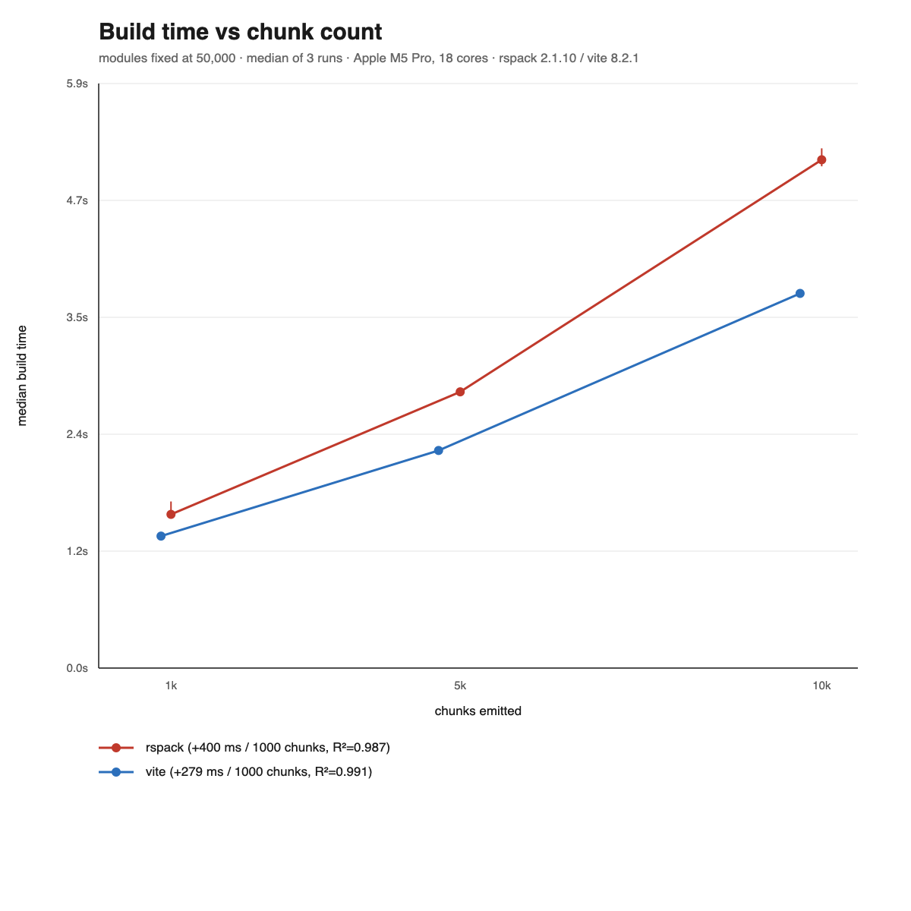
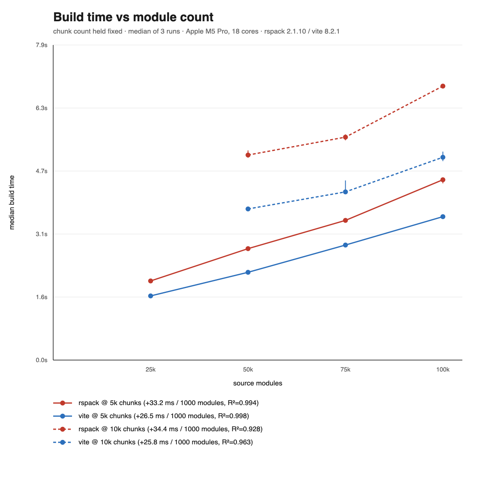

# Results — synthetic chunk-scaling benchmark

First measured round. All numbers here were produced by the harness in this
repo and can be regenerated from `bench.json` / `bench.csv`.

```
node scripts/bench.mjs          # measure (writes bench.json + bench.csv)
node scripts/bench-report.mjs   # fit slopes and emit the SVG charts
```

**Method.** Every build runs in its own child process. One warmup run is
executed and discarded, then 3 measured runs; the median is reported and the
min/max are drawn as whiskers. The output directory is deleted before each run,
so no build reuses work. Minification is on for both bundlers.

**Environment.** Apple M5 Pro, 18 cores, 48 GB, macOS, Node v22.23.1,
rspack 2.1.10, Vite 8.2.1 (Rolldown 1.2.4). Single machine, so treat
cross-tool ratios as more durable than absolute times.

Run-to-run spread was 0.7%–8.5% (median ~2.5%).

---

## Chunk axis — modules fixed at 50,000, chunks dialed 1k → 10k



| bundler | slope | R² | intercept |
|---|---|---|---|
| rspack 2.1.10 | **+400 ms / 1,000 chunks** | 0.987 | 1.02 s |
| Vite 8.2.1 | **+279 ms / 1,000 chunks** | 0.991 | 1.02 s |

rspack pays about **1.43×** more per chunk than Vite.

**The linear fit flatters both tools — the real cost is superlinear.** Fitting a
straight line to three points hides that the per-chunk cost is itself rising:

| segment | rspack | Vite |
|---|---|---|
| 1k → 5k chunks | 309 ms / 1,000 | 225 ms / 1,000 |
| 5k → 10k chunks | **468 ms / 1,000** | **317 ms / 1,000** |

So the marginal chunk at 10k costs roughly 1.5× what it cost at 1k, for both
bundlers. Quoting a single slope for this axis is a convenient approximation,
not a law, and it will understate the cost of growth for anyone already high on
the curve.

## Module axis — chunk count held fixed, modules dialed 25k → 100k



| bundler | at 5k chunks | at 10k chunks |
|---|---|---|
| rspack 2.1.10 | +33.2 ms / 1,000 modules (R²=0.994) | +34.4 ms / 1,000 modules (R²=0.928) |
| Vite 8.2.1 | +26.5 ms / 1,000 modules (R²=0.998) | +25.8 ms / 1,000 modules (R²=0.963) |

The module slope is **independent of the chunk level** — the two lines per
bundler are parallel, differing by 3.6% (rspack) and 2.6% (Vite). That is the
generator's orthogonality claim holding in the time domain, not merely in the
counts: dialing chunks does not change what a module costs.

## Cross-tool comparison on identical sources

| case | rspack | Vite | ratio | chunks (rspack/Vite) |
|---|---|---|---|---|
| m10k-c1k | 488 ms | 432 ms | 1.13× | 1000 / 901 |
| m50k-c1k | 1549 ms | 1330 ms | 1.16× | 1000 / 862 |
| m25k-c5k | 1977 ms | 1603 ms | 1.23× | 5000 / 4701 |
| m50k-c5k | 2784 ms | 2193 ms | 1.27× | 5000 / 4701 |
| m75k-c5k | 3490 ms | 2874 ms | 1.21× | 5000 / 4701 |
| m100k-c5k | 4505 ms | 3583 ms | 1.26× | 5000 / 4701 |
| m50k-c10k | 5123 ms | 3776 ms | 1.36× | 10000 / 9701 |
| m75k-c10k | 5570 ms | 4202 ms | 1.33× | 10000 / 9701 |
| m100k-c10k | 6845 ms | 5067 ms | 1.35× | 10000 / 9701 |

**rspack's disadvantage is chunk-driven, not module-driven.** The ratio climbs
from 1.13× at 1k chunks to ~1.35× at 10k chunks, while moving along the module
axis at a fixed chunk count barely moves it (1.23× → 1.26× across a 4× module
range). This is consistent with the per-chunk slopes above.

Vite emits fewer chunks because a vendor reachable from exactly one route shares
that route's reachability signature and gets folded into it, whereas rspack's
`minChunks: 1` hoists it into its own chunk. The counts match the predicted
relation exactly at every case (see the design doc).

## What this does and does not measure

These numbers isolate **graph shape**: how build time responds to chunk count
and module count, with everything else held constant. They deliberately exclude
the things a real application also pays for — JSX/TypeScript transforms, CSS
pipelines, source maps, framework plugins, type checking, and multi-environment
builds. Generated module bodies are ~345 bytes of plain JavaScript using
`React.createElement`, so no transform loader runs on either side.

That exclusion is the point: it makes the two axes measurable in isolation. But
it also means these slopes are a **floor**, not an estimate of any real
application's build time. A real app of the same module and chunk count will be
substantially slower, and the difference is attributable to per-module work and
per-compiler overhead rather than to graph size.

**Caveats.** n=3 per point on one machine; the chunk axis has only three points,
which is enough to show curvature but not to characterise it; module bodies are
uniform, where real codebases have a long tail of large files.
